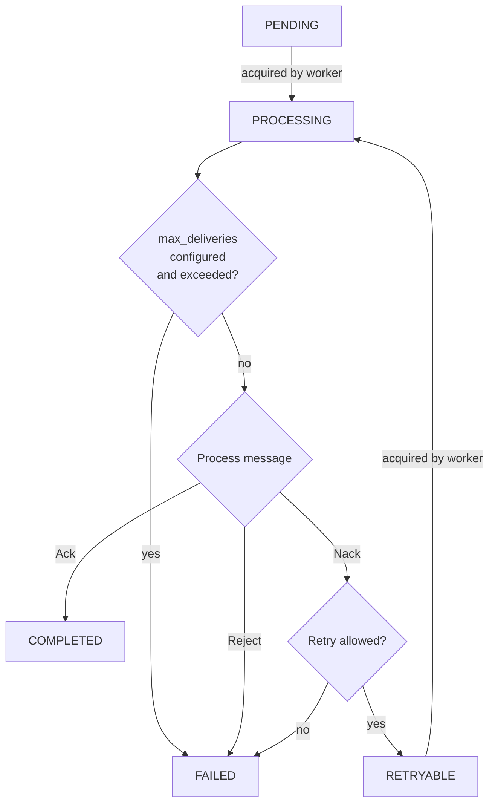

---
# 0.5 - API
# 2 - Release
# 3 - Contributing
# 5 - Template Page
# 10 - Default
search:
  boost: 10
---

!!! warning "Alpha"
    `faststream-sqlbroker` is currently in alpha.

# Design and Features

## Message Lifecycle

A published message starts out as `PENDING`. When it is acquired by a worker, it is marked as `PROCESSING`, which prevents it from being acquired by other worker processes. If the maximum allowed number of deliveries is configured and exceeded, the message is marked as `FAILED`. If not, the message is processed. If processing didn't raise an exception or if the message was manually [Acked](../sqlbroker/tutorial.md#ack){.internal-link} in the handler, it is marked as `COMPLETED`. If the message was manually [Nacked](../sqlbroker/tutorial.md#nack){.internal-link} or [Rejected](../sqlbroker/tutorial.md#reject){.internal-link} or if processing raised an exception and [`AckPolicy`](../getting-started/acknowledgement.md){.internal-link} was set to `REJECT_ON_ERROR` or `NACK_ON_ERROR`, the message is [Nacked](../sqlbroker/tutorial.md#nack){.internal-link} or [Rejected](../sqlbroker/tutorial.md#reject){.internal-link}. [Rejected](../sqlbroker/tutorial.md#reject){.internal-link} messages are marked as `FAILED`. For [Nacked](../sqlbroker/tutorial.md#nack){.internal-link} messages, the retry policy determines if the message is allowed to be retried. If retry is allowed, the message is marked as `RETRYABLE`. If not, the message is marked as `FAILED`.

`PENDING`, `PROCESSING`, and `RETRYABLE` messages reside in the main table. On status change, `COMPLETED` and `FAILED` messages are removed from the main table and, depending on `retain_in_archive_on_ack` and `retain_in_archive_on_reject`, copied to the archive table.



## Subscriber Internals

On start, the subscriber spawns four types of concurrent loops:

**1. Fetch loop** &mdash; Periodically fetches batches of `PENDING` or `RETRYABLE` messages from the database, simultaneously updating them: marking as `PROCESSING`, setting `acquired_at` to now, and incrementing `deliveries_count`. Only messages with `next_attempt_at <= now` are fetched, ordered by `next_attempt_at`. The fetched messages are placed into an internal queue. The fetch limit is the minimum of `fetch_batch_size` and the free buffer capacity (`fetch_batch_size * overfetch_factor` minus currently queued messages). If the last fetch was "full" (returned as many messages as the limit), the next fetch happens after `min_fetch_interval`; otherwise after `max_fetch_interval`.

**2. Worker loops** (`max_workers` concurrent instances) &mdash; Each worker takes a message from the internal queue and first checks if `max_deliveries` has been exceeded; if so, the message is [Rejected](../sqlbroker/tutorial.md#reject){.internal-link} without processing. Otherwise, processing proceeds. Depending on the processing result, [`AckPolicy`](../getting-started/acknowledgement.md){.internal-link}, and manual [Ack](../sqlbroker/tutorial.md#ack){.internal-link}/[Nack](../sqlbroker/tutorial.md#nack){.internal-link}/[Reject](../sqlbroker/tutorial.md#reject){.internal-link}, the message is [Acked](../sqlbroker/tutorial.md#ack){.internal-link}, [Nacked](../sqlbroker/tutorial.md#nack){.internal-link}, or [Rejected](../sqlbroker/tutorial.md#reject){.internal-link}. For [Nacked](../sqlbroker/tutorial.md#nack){.internal-link} messages, the `retry_strategy` is consulted to determine if and when the message might be retried. If allowed to be retried, the message is marked as `RETRYABLE`; otherwise as `FAILED`. [Acked](../sqlbroker/tutorial.md#ack){.internal-link} messages are marked as `COMPLETED` and rejected messages are marked as `FAILED`. The message is then buffered for flushing.

**3. Flush loop** &mdash; Periodically flushes the buffered message state changes to the database. `COMPLETED` and `FAILED` messages are removed from the primary table and, depending on `retain_in_archive_on_ack` and `retain_in_archive_on_reject`, copied to the archive table. The state of `RETRYABLE` messages is updated in the primary table.

**4. Release stuck loop** &mdash; Periodically releases messages that have been stuck in `PROCESSING` state for longer than `release_stuck_timeout` since `acquired_at`. These messages are marked back as `PENDING`.

On stop, all loops are gracefully stopped. Messages that have been acquired but are not yet being processed are drained from the internal queue and marked back as `PENDING`. The subscriber waits for all tasks to complete within `graceful_timeout`, then performs a final flush.

## Features

### Supported Databases

PostgreSQL, MySQL, and SQLite are currently supported.

### Processing Guarantees

This design adheres to the **"at least once"** processing guarantee because flushing changes to the database happens only after a processing attempt. A flush might not happen due to e.g. a crash. This might lead to messages being processed more times than allowed by the `retry_strategy`, and to the database state being inconsistent with the true number of attempts.

### Work Sharing

Multiple subscriber instances (in different processes or on different machines) can safely consume from the same queue without double-processing because `SELECT ... FOR UPDATE SKIP LOCKED` is utilized

### Short-Lived Transactions

This design opts for separate short-lived transactions instead of a single one. This first one fetches messages with `SELECT ... FOR UPDATE SKIP LOCKED` and sets their state to `PROCESSING`, which prevents them from being fetched by other processes/nodes. The other two transactions flush message state updates to the database.

### Poison Message Protection

Setting `max_deliveries` to a non-`None` value provides protection from the [poison message problem](https://www.rabbitmq.com/docs/quorum-queues#poison-message-handling){.external-link target="_blank"} (messages that crash the worker without the ability to catch the exception, e.g. due to OOM terminations) because `deliveries_count` is incremented and `max_deliveries` is checked prior to a processing attempt. However, this comes at the expense of potentially over-counting deliveries, especially for messages that are being processed concurrently with the poison message (a crash would leave them with incremented `deliveries_count` despite possibly not having been processed), and violating the at-most-once processing semantics.

### Dead Letter Queue

The archive table doubles as a dead-letter queue: if the broker defines an archive table (`message_archive_table_name`) and `retain_in_archive_on_reject` is `True` (default), `FAILED` messages ([Rejected](../sqlbroker/tutorial.md#reject){.internal-link}, or [Nacked](../sqlbroker/tutorial.md#nack){.internal-link} with retries exhausted) are archived there.

### Ordered Processing

As of now, to achieve processing strictly in the order of `next_attempt_at` (or in the order of publishing if no `next_attempt_at` was provided), only one process should be consuming from the same queue and its concurrency should be set to 1 with `max_workers=1`.

### Delayed Delivery and Retries

[Delayed delivery](../sqlbroker/tutorial.md#delayed-delivery){.internal-link} is supported with the use of `next_attempt_at`, and the same field is set by retry strategies for [delayed retries](../sqlbroker/tutorial.md#delayed-retries){.internal-link}.

### No Fanout

As of now, fanout, where each of the consumer groups processes every message, is not supported.

### No LISTEN/NOTIFY

As of now, `LISTEN/NOTIFY` is not supported.

## SQL Statements

### Acquire Messages

=== "PostgreSQL"
    ```sql linenums="1"
    WITH
      ready AS (
        SELECT
          message.id AS id,
          message.queue AS queue,
          message.headers AS headers,
          message.payload AS payload,
          message.state AS state,
          message.attempts_count AS attempts_count,
          message.deliveries_count AS deliveries_count,
          message.created_at AS created_at,
          message.first_attempt_at AS first_attempt_at,
          message.next_attempt_at AS next_attempt_at,
          message.last_attempt_at AS last_attempt_at,
          message.acquired_at AS acquired_at
        FROM
          message
        WHERE
          (
            message.state = $4::sqlbrokermessagestate
            OR message.state = $5::sqlbrokermessagestate
          )
          AND message.next_attempt_at <= $6::TIMESTAMP WITHOUT TIME ZONE
          AND (
            message.queue = $7::VARCHAR
            OR message.queue = $8::VARCHAR
          )
        ORDER BY
          message.next_attempt_at
        LIMIT
          $9::INTEGER
        FOR UPDATE
          SKIP LOCKED
      ),
      updated AS (
        UPDATE message
        SET
          state = $1::sqlbrokermessagestate,
          deliveries_count = (message.deliveries_count + $2::BIGINT),
          acquired_at = $3::TIMESTAMP WITHOUT TIME ZONE
        WHERE
          message.id IN (
            SELECT
              ready.id
            FROM
              ready
          )
        RETURNING
          message.id,
          message.queue,
          message.headers,
          message.payload,
          message.state,
          message.attempts_count,
          message.deliveries_count,
          message.created_at,
          message.first_attempt_at,
          message.next_attempt_at,
          message.last_attempt_at,
          message.acquired_at
      )
    SELECT
      updated.id,
      updated.queue,
      updated.headers,
      updated.payload,
      updated.state,
      updated.attempts_count,
      updated.deliveries_count,
      updated.created_at,
      updated.first_attempt_at,
      updated.next_attempt_at,
      updated.last_attempt_at,
      updated.acquired_at
    FROM
      updated
    ORDER BY
      updated.next_attempt_at
    ```

=== "MySQL"
    ```sql linenums="1"
    BEGIN;

    SELECT
      message.id AS id
    FROM
      message
    WHERE
      (
        message.state = % s
        OR message.state = % s
      )
      AND message.next_attempt_at <= % s
      AND (
        message.queue = % s
        OR message.queue = % s
      )
    ORDER BY
      message.next_attempt_at
    LIMIT
      % s FOR
    UPDATE SKIP LOCKED;

    UPDATE message
    SET
      state = % s,
      deliveries_count = (message.deliveries_count + % s),
      acquired_at = % s
    WHERE
      message.id IN (% s);

    COMMIT;
    ```

=== "SQLite"
    ```sql linenums="1"
    WITH ready AS (
      SELECT
        message.id AS id
      FROM
        message
      WHERE
        (message.state = ? OR message.state = ?)
        AND message.next_attempt_at <= ?
        AND message.queue = ?
      ORDER BY
        message.next_attempt_at
      LIMIT ? OFFSET ?
    )
    UPDATE message
    SET
      state = ?,
      deliveries_count = (message.deliveries_count + ?),
      acquired_at = ?
    WHERE
      message.id IN (SELECT ready.id FROM ready)
    RETURNING
      id AS id,
      queue AS queue,
      headers AS headers,
      payload AS payload,
      state AS state,
      attempts_count AS attempts_count,
      deliveries_count AS deliveries_count,
      created_at AS created_at,
      first_attempt_at AS first_attempt_at,
      next_attempt_at AS next_attempt_at,
      last_attempt_at AS last_attempt_at,
      acquired_at AS acquired_at
    ```

### Archive Messages

When `retain_in_archive_on_ack` (for `COMPLETED` messages) or `retain_in_archive_on_reject` (for `FAILED` messages) is `False`, the `INSERT INTO message_archive` is skipped for those messages.

=== "PostgreSQL"
    ```sql linenums="1"
    BEGIN;

    INSERT INTO
      message_archive (
        id,
        queue,
        headers,
        payload,
        state,
        attempts_count,
        deliveries_count,
        created_at,
        first_attempt_at,
        last_attempt_at,
        archived_at
      )
    VALUES
      (
        $1::BIGINT,
        $2::VARCHAR,
        $3::JSON,
        $4::BYTEA,
        $5::sqlbrokermessagestate,
        $6::BIGINT,
        $7::BIGINT,
        $8::TIMESTAMP WITHOUT TIME ZONE,
        $9::TIMESTAMP WITHOUT TIME ZONE,
        $10::TIMESTAMP WITHOUT TIME ZONE,
        $11::TIMESTAMP WITHOUT TIME ZONE
      );

    DELETE FROM message
    WHERE
      message.id IN ($1::BIGINT);

    COMMIT;
    ```

=== "MySQL"
    ```sql linenums="1"
    BEGIN;

    INSERT INTO
      message_archive (
        id,
        queue,
        headers,
        payload,
        state,
        attempts_count,
        deliveries_count,
        created_at,
        first_attempt_at,
        last_attempt_at,
        archived_at
      )
    VALUES
      (
        % s,
        % s,
        % s,
        % s,
        % s,
        % s,
        % s,
        % s,
        % s,
        % s,
        % s
      );

    DELETE FROM message
    WHERE
      message.id IN (% s);
    ```

=== "SQLite"
    ```sql linenums="1"
    BEGIN;

    INSERT INTO message_archive (
      id,
      queue,
      headers,
      payload,
      state,
      attempts_count,
      deliveries_count,
      created_at,
      first_attempt_at,
      last_attempt_at,
      archived_at
    )
    VALUES
      (?, ?, ?, ?, ?, ?, ?, ?, ?, ?, ?);

    DELETE FROM message
    WHERE
      message.id IN (?);

    COMMIT;
    ```

### Requeue Messages

=== "PostgreSQL"
    ```sql linenums="1"
    UPDATE message
    SET
      state = $1::sqlbrokermessagestate,
      attempts_count = $2::BIGINT,
      deliveries_count = $3::BIGINT,
      first_attempt_at = $4::TIMESTAMP WITHOUT TIME ZONE,
      next_attempt_at = $5::TIMESTAMP WITHOUT TIME ZONE,
      last_attempt_at = $6::TIMESTAMP WITHOUT TIME ZONE,
      acquired_at = $7::TIMESTAMP WITHOUT TIME ZONE
    WHERE
      message.id = $8::BIGINT
    ```

=== "MySQL"
    ```sql linenums="1"
    UPDATE message
    SET
      state = % s,
      attempts_count = % s,
      deliveries_count = % s,
      first_attempt_at = % s,
      next_attempt_at = % s,
      last_attempt_at = % s,
      acquired_at = % s
    WHERE
      message.id = % s
    ```

=== "SQLite"
    ```sql linenums="1"
    UPDATE message
    SET
      state = ?,
      attempts_count = ?,
      deliveries_count = ?,
      first_attempt_at = ?,
      next_attempt_at = ?,
      last_attempt_at = ?,
      acquired_at = ?
    WHERE
      message.id = ?
    ```

Note that for bulk updates the arguments are sent in a batch in a single network call using `execute_many()`.

### Requeue Stuck Messages

=== "PostgreSQL"
    ```sql linenums="1"
    UPDATE message
    SET
      state = $1::sqlbrokermessagestate,
      next_attempt_at = $2::TIMESTAMP WITHOUT TIME ZONE,
      acquired_at = $3::TIMESTAMP WITHOUT TIME ZONE
    WHERE
      message.id IN (
        SELECT
          message.id
        FROM
          message
        WHERE
          message.state = $4::sqlbrokermessagestate
          AND message.acquired_at < $5::TIMESTAMP WITHOUT TIME ZONE
      )
    ```

=== "MySQL"
    ```sql linenums="1"
    UPDATE message
    SET
      state = % s,
      next_attempt_at = % s,
      acquired_at = % s
    WHERE
      message.id IN (
        SELECT
          anon_1.id
        FROM
          (
            SELECT
              message.id AS id
            FROM
              message
            WHERE
              message.state = % s
              AND message.acquired_at < % s
          ) AS anon_1
      )
    ```

=== "SQLite"
    ```sql linenums="1"
    UPDATE message
    SET
      state = ?,
      next_attempt_at = ?,
      acquired_at = ?
    WHERE
      message.id IN (
        SELECT
          message.id
        FROM
          message
        WHERE
          message.state = ?
          AND message.acquired_at < ?
      )
    ```
